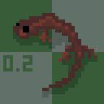

    
     
    <h3>Hynobius</h3>
    A chess engine with tutorals and documents.
     
    A chess engine with scientific testing.
     
    A chess game analyser using Hynobius chess engine.

# Hynobius

A C++ chess engine with **tutorials**, **documents**, **scientifuc testing** and **web analysis interface**.

- Non-bitboard implementation.
- Alpha-beta search with optimizations.
- Experimentations and Elo improvements.
- Web analysis with `WASM`.

---

## Overview

### [Full Documents Right Here](docs/project-overview.md)

### Hynobius Chess Engine

It is a chess engine focus on:

- Effective search. (alpha-beta, move ordering, TT, iterative deepening, aspiration window).
- Evaluation experiment.

### Hynobius Testing

It is a tesing system using github actions, CuteChess, and self-hosted runner.

### Hynobius Web Analysis

It is a website held by githib pages, and use `WASM` to compile engine.

---

## Features

---

## Examples

---

## Usage

---

## Project Structure

---

## Acknowledgements

### Resources

- **Bhupen** with his mate-in-one FEN uploaded **[on kaggle.com](https://www.kaggle.com/datasets/ancientaxe/mate-in-one-chess?resource=download)**.

### Tools

- **[Cute Chess](https://github.com/cutechess/cutechess)** with its easy-to-use interface for playing chess.
- **[Lichess](https://Lichess.org)** with its platform to set up bots and play with other engines.

### Inspirations

- **[Stockfish](https://github.com/official-stockfish/stockfish)** with its clean structure and implementations.

### AIs

- **[ChatGPT (project attached)](https://chatgpt.com/g/g-p-69381984e7988191afa09bafbf015c43-c-cheng-shi-shi-zuo-xi-yang-qi-fen-xi-yin-qing/project)** with its detailed help.