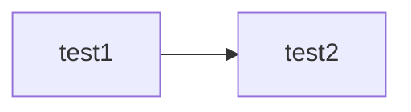

# project overview

## 1. 設計目標

- 可分析棋局，並給予著法回饋如：「此著是 ??大漏著 ，因為下一步你的 Queen 就要被 Fork 了」
- 可簡單下棋，與使用者對戰
- 可在網頁上呈現最佳著法，並以箭頭表示
- 有明確功能分區，讓程式碼不混亂

## 2. 模組劃分

| 檔案名稱 | 功能 |
| - | - |
| main | 主要程式執行序 |
| debug | 除錯輸出專用 |

### `board/`

| 檔案名稱 | 功能 |
| - | - |
| Attack | 全盤攻擊圖 (`AttackMap`)、檢查格子攻擊 (`countSquareAttacks`) |
| Board | 棋盤主體 |
| Check | 檢查玩家是否被將軍 (`isInCheck`)|
| Piece | 定義棋子、檢查棋子顏色 (`isWhite & isBlack & isSameColor`) |

### `move/`

| 檔案名稱 | 功能 |
| - | - |
| Generate_Move | 生成目前盤面上所有合法著法 (`generateAllLegalMoves`)、生成所有合法吃子 (`generateLegalCaptureMoves`) |
| Generate_Position | 生成特定棋子可移動位置 (`generatePiecePosFromPos`)、生成可吃子位置 (`generatePieceCaptureFromPos`) |
| Move | 移動主體、檢查移動合法性 (`isMoveLegal`) |
| Move_Order | 將著法排序，增加剪枝速度 (`sortMove`) |
| Make_Move | 執行與反悔移動 (`makeMove & undoMove`) |

### `search/`

| 檔案名稱 | 功能 |
| - | - |
| Search | 進行 `negamax` search, `quietscence` |
| TT | Zobrist hash 記憶化搜索 |

### `evaluate/`

| 檔案名稱 | 功能 |
| - | - |
| Control_Center | 檢查中心是否有攻擊、佔據 (`evaluateCenterControl`) |
| Evaluate | 所有評估彙整 |
| King_Safety | 檢查王安全性 (`evaluateKingSafety`) |
| Material_Point | 棋子價值回傳 (`pieceValue`) |
| Mobility | 評估棋子可行動力 (`evaluate knight / bishop / rook  Mobility`) |
| PST | 棋子位置評分 (`evaluatePieceSquare`) |
| SEE | 棋子交換盈虧評分 (`SEE`) |
| Tempo | 出子優先評分 (`evaluateTempo`) |

### `pgn/`

| 檔案名稱 | 功能 |
| - | - |
| Pgn_Parser | 轉換完整遊戲 PGN 變成合法著法 |
| Pgn_Transformer | 轉換位置與 PGN (`pgnToPosition & positionToPgn`) |
| Valid_Piece | 轉換玩家與棋子 (`playerPieceCharToPiece`)|

## 3. 資料流

## 4. 專案參考與 AI 使用

### [Stockfish 18](https://github.com/official-stockfish)

這是世界上最強的引擎之一，當然要參考他的架構。

### [ChatGPT 協助](https://chatgpt.com/g/g-p-69381984e7988191afa09bafbf015c43-c-cheng-shi-shi-zuo-xi-yang-qi-fen-xi-yin-qing/project)