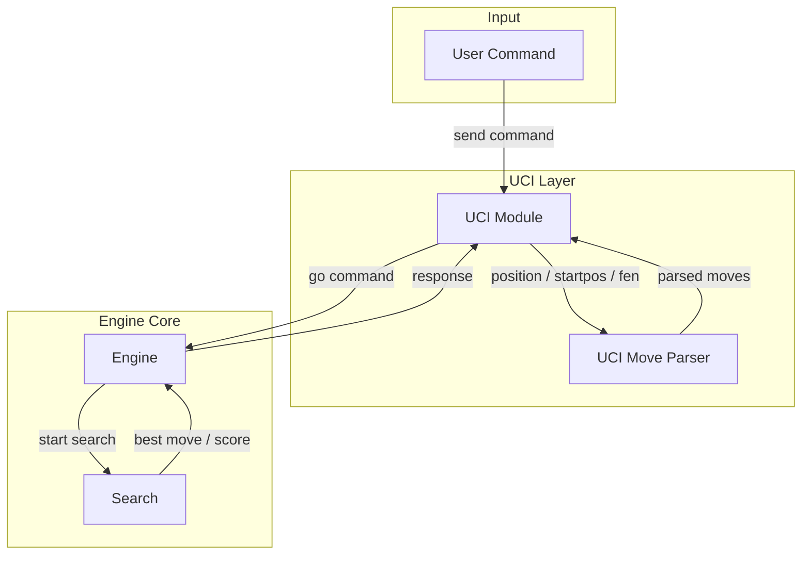

# Archetecture

## Purpose

## Modules

### Piece

- Check a piece is white or black.
- Check whether two pieces share the same color.
- Transform functions between `Piece` and `char`.

### Board

- 8x8 board array.
- every pieces' positions (`piecePos[][]`).
- every pieces' count on the board (`pieceCnt[]`).
- material score.
- PST score.
- side to play (`player`).
- castling rights.
- zobrist key for the current board.

### Attack

- check a square is either attacked or not.
- count attacks in a square.

### Evaluate

- class `Evaluate` to evaluate the current board.
- castle rights evaluation.
- center control evaluation.
- king safety evaluation.
- material points.
- mobility.
- pawn structure evaluation.
- PST.
- SEE.
- tempo.

### Generates

- generate pseudo-legal positions, including pieces, pawns and castling.
- generate pseudo-legal moves, including pieces, pawns and castling.
- generate pseudo-legal capture moves especially for quietscene search.

### Make Move

- `makeCastleMove, undoCastleMove` especitally for castles.
- `makeMove, undoMove`.

### Search

- `findBestMove`, the start of the search progress.
- `searchRootCore` is separated for `aspiration window`.
- `negamax`, the main search progress.
- `quietscence` will process in a leaf node to avoid `horizen effect`.

## Data Flow

### UCI play Flow

### Make Move Flow

1. record current castle rights, material points, PST, and zobrist key.
2. update castle rights.
3. update board pieces.
4. update material score.
5. update PST.
6. update zobrist key.
7. update `piecePos`.

### Undo Move Flow

1. recover castle rights, material points, PST, and zobrist key.
2. recover board pieces.
3. recover `piecePos`.
