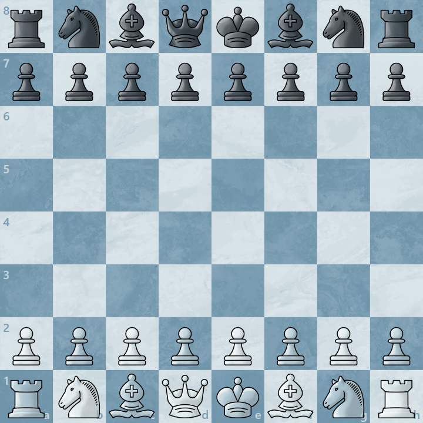

# Chess Engine

## Describe in One Sentence

An AI or an algorithm that plays chess **VERY WELL**.

---

## Introduction

A chess engine is a program designed to play chess or analyze chess.

Unlike human chess players,it doesn't "think" or "understand" chess like we do.
Instead, It **represents the board using data structures, generate legal moves, search for future possibilities, and evaluate positions using math**.

### How it works?

There are basically two kinds of engine.
One uses **alpha-beta search and hand-made evaluation algorithms**, the other uses **Monte Carlo search and neural nets** to play chess.

#### Alpha-beta Search + Hand-made Evaluation

Traditional chess engines, such as Stockfish, use search algorithms and evaluate algorithms to play chess.

For a board like the picture below:

(The picture comes from chess.com.)

It will **generate moves**, which means the engine will play **every possible moves in its mind**:

(The picture comes from chess.com.)

And evaluate them to analyze which move is the best.

Although the GIF only represents every move we can play as white, but the engine **does not only search for these moves**.
The engine will also search from the board when the previous move has made, which means:

(The picture comes from chess.com.)

There are 20 branches from the starting position of chess, and the engine will search like:

(The picture comes from chess.com.)

Just like a tree, that is how the engine will recurse itself and keep searching.

As for what alpha-beta search really is, it is a algorithm to cut off bad branches and reduce search nodes.

Please check out the picture below.

(The picture is from chessprogramming.org)

This is a short example of how alpha-beta search can help cut bad branches. For futher information, please check out [alpha-beta search](\Hynobius\tutorials\alpha_beta_search.md).

#### Monte Carlo Tree Search + Neural Networks

Because the main focus of this project is traditional search engines, this section only gives a simplified overview of AI-based chess engines.

AI-based engines, such as Leela Chess Zero (Lc0), use a neural network together with Monte Carlo Tree Search (MCTS). Instead of using a hand-made evaluation function and alpha-beta pruning, the neural network guides the search by providing two main outputs: a policy and a value.

The **policy** suggests which moves are promising and should be explored first. It does not directly prove that a move is good; it only gives the search an initial preference.

The **value** estimates how good the current position is, usually in terms of expected game result or winning chances.

MCTS works by repeatedly running search iterations from the current position. Each iteration usually contains four steps:

1. **Selection**  
   Starting from the root position, the engine follows the most promising path according to the current search statistics.

2. **Expansion**  
   When the search reaches a new position, the engine adds new child nodes to the search tree.

3. **Evaluation**  
   The neural network evaluates the new position and returns a policy and a value.

4. **Backup**  
   The value is propagated back through the visited path, updating statistics such as visit count and average value.

Over many iterations, MCTS gradually spends more search effort on moves that look promising. A move with a high policy may be explored early, but the final move choice is usually based on accumulated search statistics, especially visit count and evaluated value.

This is different from alpha-beta search. Alpha-beta search is usually a depth-first search with pruning, while MCTS is a selective, statistics-based search. It does not search every branch equally. Instead, it tries to allocate more computation to the branches that are more likely to matter.

Because neural network evaluation is computationally expensive, AI-based engines usually search fewer nodes per second than traditional engines. However, each evaluated node contains richer positional information from the neural network, allowing the engine to guide its search more selectively.

#### Combination?

A technique called **Efficiently updatable neural network** was invented in around 2018.
It is a neural net but it can update fast, which means **it is stronger than hand-made evaluation algorithms**. Thus it has been used in almost every top chess engines.

### Core Components

#### Board

#### Move generation

#### Search

#### Evaluate

---

## Application
